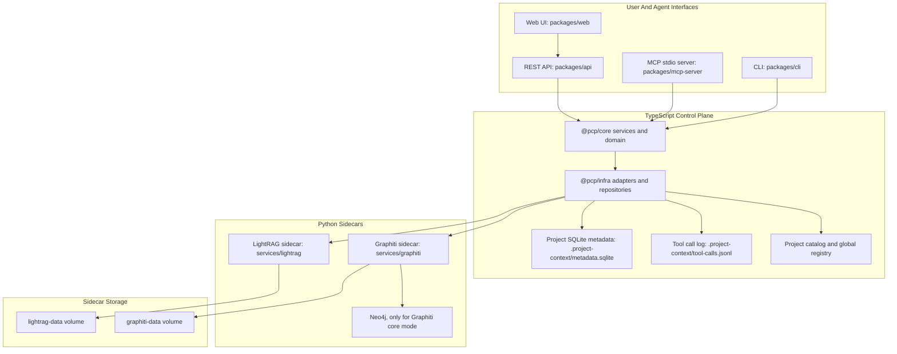
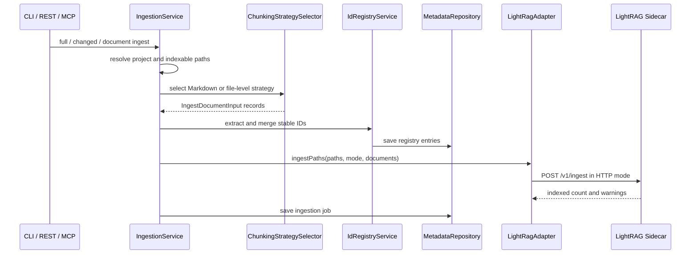
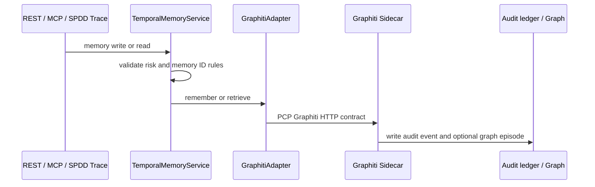
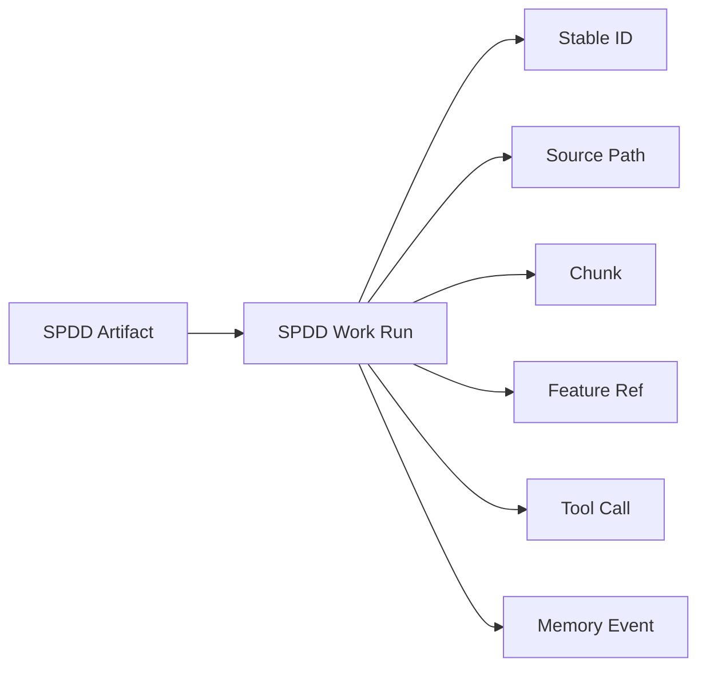

# Project Context Platform System And Service Map

Last researched: 2026-05-16

This document is the current state map for Project Context Platform (PCP). It is intended to help future implementation work start from the same architecture model, reduce scattered fixes, and make service ownership boundaries explicit.

PCP is a local-first project context control plane. It registers local workspaces, indexes project files, extracts stable IDs, stores canonical chunk metadata, exposes retrieval and memory through REST and MCP, records SPDD work traceability, and provides an operator UI.

## System Purpose

PCP answers these operational questions for developers and AI agents:

- Which projects are registered and active?
- Which files, chunks, stable IDs, SPDD artifacts, and memory events exist for a project?
- What exact specification context should be used for a requirement, decision, task, or source path?
- What previous decisions, requirement changes, reviews, implementation summaries, and approvals are known?
- Which SPDD prompt or implementation run touched a file, stable ID, chunk, feature, tool call, or memory event?
- Is indexed context fresh enough to trust before starting implementation?
- What actual records are in the document index, not just what semantic search ranks highly?

The system intentionally stays local-first. It does not require remote project access. External LLM or embedding providers are optional and only used by sidecar core modes when explicitly configured.

## Runtime Topology

### Runtime Ports And Defaults

| Component | Default endpoint | Owner | Notes |
|---|---:|---|---|
| REST API | `127.0.0.1:4318` | `packages/api` | Fastify API used by UI and direct clients. |
| Web UI | `127.0.0.1:5173` | `packages/web` | Vite React operator interface. |
| LightRAG sidecar | `127.0.0.1:9621` | `services/lightrag` | PCP HTTP contract for indexing and retrieval. |
| Graphiti sidecar | `127.0.0.1:8091` | `services/graphiti` | PCP HTTP contract for temporal memory. |
| Neo4j browser | `127.0.0.1:7474` | Docker Compose | Used only when Graphiti core backend is active. |
| Neo4j Bolt | `127.0.0.1:7687` | Docker Compose | Used only when Graphiti core backend is active. |

## Package And Service Responsibilities

| Area | Path | Responsibility | Must not own |
|---|---|---|---|
| Core domain and services | `packages/core` | Domain types, service orchestration, config parsing, stable ID extraction, ingestion preparation, retrieval composition, memory policy, SPDD trace, observability. | HTTP transport details, SQLite SQL, browser UI state, sidecar vendor package logic. |
| Infrastructure adapters | `packages/infra` | Adapter implementations, SQLite repository, JSONL tool-call logs, project-aware repository routing, local fallback adapters, HTTP clients. | Business rules that belong in core services. |
| REST API | `packages/api` | Fastify route surface, query/body validation, error mapping, API health aggregation. | Retrieval semantics, ingestion rules, sidecar internals. |
| MCP server | `packages/mcp-server` | MCP tool registration, input mapping, preview shaping, tool-call logging wrapper. | Separate business behavior from REST for the same capability. |
| CLI | `packages/cli` | Developer commands for project registration, ingestion, ID validation, diagnostics, and SPDD trace commands. | Long-lived service state beyond invoking core services. |
| Web UI | `packages/web` | Operator views over REST APIs: projects, ingestion, document index, IDs, search, memory, approvals, logs, context health, SPDD trace, settings. | Adapter-mode decisions or direct sidecar access. |
| LightRAG sidecar | `services/lightrag` | HTTP contract for document ingest, document index listing, search, exact spec context, related code, requirement sources, document lookup, project deletion. | Project workspace scanning, stable ID extraction, UI behavior, Graphiti memory. |
| Graphiti sidecar | `services/graphiti` | HTTP contract for memory writes, current facts, temporal history, approvals, and project memory deletion. | Document indexing, code search, SPDD artifact scanning. |
| Tests | `tests` and service smoke tests | Contract, adapter, chunking, route, and smoke coverage. | Production service behavior. |

## Main Data Model

The central domain model is in `packages/core/src/domain/types.ts`.

| Concept | Purpose | Storage owner | Main readers |
|---|---|---|---|
| `ProjectWorkspace` | Registered local project boundary with root path and `.project-context` paths. | Global registry and project catalog. | API, CLI, MCP, all services. |
| `ProjectConfig` | Include/ignore rules, ID rules, sidecar URLs/timeouts, memory policy, API/UI settings. | `.project-context/config.yml`. | Ingestion, workspace service, observability. |
| `IngestionJob` | Audit row for full, changed, or document indexing. | Project SQLite metadata. | Ingestion status API, UI, freshness metrics. |
| `CanonicalDocumentChunk` | Retrieval and index unit with source path, content, stable IDs, type, status, provenance, and chunk metadata. | SQLite metadata and LightRAG sidecar storage. | Document Index UI, retrieval tools, observability, SPDD trace. |
| `IdRegistryEntry` | Stable ID catalog row with category, domain, path, heading, line range, aliases, and status. | Project SQLite metadata. | ID Registry UI, validation, exact retrieval context, observability. |
| `ToolCallLogEntry` | Compact audit record for MCP tool calls. | `.project-context/tool-calls.jsonl`. | Tool Call Logs UI, observability, SPDD trace. |
| `SpddArtifact` | Cataloged SPDD prompt, analysis, plan, or review artifact. | Project SQLite metadata. | SPDD Trace UI/API/MCP, context graph. |
| `SpddWorkRun` | Recorded SPDD-driven unit of work. | Project SQLite metadata, optionally mirrored to Graphiti. | SPDD Trace, memory, context graph. |
| `SpddTraceLink` | Typed relation from an SPDD run to stable IDs, source paths, chunks, feature refs, tool calls, or memory events. | Project SQLite metadata. | SPDD lookup, context graph, freshness and quality metrics. |
| Memory event | Decision, requirement change, review, implementation summary, or approval. | Graphiti sidecar audit store and optional graph backend. | Memory UI, memory MCP tools, composer current facts/history. |

## Storage Map

| Storage | Path or volume | Contains | Source of truth for |
|---|---|---|---|
| Workspace config | `.project-context/config.yml` in each registered project | Indexing rules, ID settings, sidecar URL defaults, API/UI settings. | Project-local configuration. |
| Project metadata SQLite | `.project-context/metadata.sqlite` | Ingestion jobs, chunks, stable ID registry, SPDD artifacts, SPDD runs, SPDD trace links. | Local exact metadata and UI index views. |
| Tool-call JSONL | `.project-context/tool-calls.jsonl` | MCP call status, duration, compact input/result summaries. | Tool-call observability. |
| Global registry | `.project-context/global-registry.json` in platform repo by default | Active project and registered workspace list. | MCP/CLI active project resolution. |
| Project catalog | Configured by `ProjectCatalogStore` | Registered workspace catalog. | Project list API. |
| LightRAG data volume | Docker volume `lightrag-data` | Contract chunks or core per-project LightRAG working data and manifests. | Retrieval sidecar state. |
| Graphiti data volume | Docker volume `graphiti-data` | Contract memory events or Graphiti audit ledgers. | Temporal memory audit. |
| Neo4j data volume | Docker volume `neo4j-data` | Graphiti core graph state. | Graphiti core graph memory only. |

## Adapter Modes

PCP has one core service layer and two adapter modes.

| Mode | Selected by | LightRAG adapter | Graphiti adapter | Intended use |
|---|---|---|---|---|
| HTTP | Default unless `PCP_ADAPTER_MODE=local` | `LightRagHttpAdapter` | `GraphitiHttpAdapter` | Normal local runtime with Python sidecars. |
| Local | `PCP_ADAPTER_MODE=local` | `LocalLightRagAdapter` | `LocalGraphitiAdapter` | Development and tests without sidecars. |

Adapter mode must be invisible to the UI and MCP users. REST and MCP call core services, core uses ports, and infra decides whether the port is local or HTTP.

## Service Map

### Workspace And Project Registration

Primary files:

- `packages/core/src/services/project-workspace-service.ts`
- `packages/core/src/config/global-registry-store.ts`
- `packages/core/src/config/project-catalog-store.ts`
- `packages/core/src/config/project-config.ts`

Responsibilities:

- Register a local project root.
- Create `.project-context/config.yml` if missing.
- Persist workspace metadata into the global registry and project catalog.
- Resolve explicit project IDs or the active project for MCP/CLI flows.

Important boundaries:

- Workspace registration owns project identity and paths.
- It does not index documents or call sidecars.
- Config defaults are created once and then loaded from project-local config.

### Ingestion

Primary files:

- `packages/core/src/services/ingestion-service.ts`
- `packages/core/src/services/id-registry-service.ts`
- `packages/core/src/services/ingestion-chunking/*`
- `packages/infra/src/local-lightrag-adapter.ts`
- `packages/infra/src/http/lightrag-http-adapter.ts`
- `services/lightrag/app.py`
- `services/lightrag/lightrag_engine.py`

Current flow:

Key behavior:

- Full ingestion requires explicit confirmation.
- Changed ingestion uses explicit paths if provided; otherwise it scans indexable files.
- Document ingestion validates the path is inside the workspace and indexable.
- Markdown and MDX use granular chunking.
- Non-Markdown files currently use file-level chunking.
- Stable ID extraction and registry merge happen in TypeScript before sidecar ingest.
- LightRAG receives already prepared chunk payloads.
- Re-ingestion marks old current chunks for the same path stale before saving replacements.

Important boundaries:

- Chunk preparation belongs to TypeScript ingestion because it shares stable ID extraction and line provenance.
- Sidecars own retrieval storage and contract behavior, not workspace scanning.
- Source-code structural chunking is not implemented yet; source files remain file-level chunks unless a future strategy is added.

### Chunking And Stable IDs

Primary files:

- `packages/core/src/services/ingestion-chunking/markdown-chunking-strategy.ts`
- `packages/core/src/services/ingestion-chunking/file-level-chunking-strategy.ts`
- `packages/core/src/services/ingestion-chunking/chunking-strategy-selector.ts`
- `packages/core/src/services/ingestion-chunking/chunk-id.ts`
- `packages/core/src/services/id-registry-service.ts`

Chunk kinds:

| Chunk kind | Used for | Notes |
|---|---|---|
| `file` | Non-Markdown source/config/text files and fallback records. | Current source-code granularity. |
| `markdown_section` | Heading-bounded Markdown sections. | Used for general document browsing/search. |
| `stable_id_anchor` | Exact stable ID occurrence outside table-row handling. | Used for surgical spec lookup. |
| `markdown_table_row` | Table row containing a stable ID, with table header and separator. | Prevents one table row from dragging previous rows into exact context. |

Stable ID behavior:

- IDs are extracted using configured prefixes and project domain rules.
- Legacy ADR headings and ADR filenames can be mapped to canonical ADR IDs when enabled.
- Duplicate detection compares current registry rows across source paths.
- Validation reports duplicates but does not currently suppress known historical duplicates.

Important boundaries:

- Avoid adding stable ID examples to documentation unless they are meant to be indexed.
- New documents that mention real stable IDs can become additional ID occurrences and create duplicate warnings.
- Exact retrieval should prefer source path and stable ID anchors over broad semantic lookup.

### Retrieval And Document Index

Primary files:

- `packages/core/src/services/retrieval-service.ts`
- `packages/core/src/services/context-composer-service.ts`
- `packages/core/src/services/staged-retrieval-pipeline.ts`
- `packages/core/src/ports/adapters.ts`
- `packages/infra/src/local-lightrag-adapter.ts`
- `packages/infra/src/http/lightrag-http-adapter.ts`
- `services/lightrag/app.py`
- `services/lightrag/lightrag_engine.py`

Retrieval surfaces:

| Capability | REST path | MCP tool | Adapter method | Sidecar path |
|---|---|---|---|---|
| Search docs | `POST /api/projects/:project_id/search` | `search_docs` | `searchDocs` | `POST /v1/search` |
| Document index listing | `GET /api/projects/:project_id/documents` | Not currently exposed as a dedicated MCP tool | `listDocuments` | `POST /v1/documents` |
| Exact spec context | `GET /api/projects/:project_id/specs/:stable_id` | `get_spec_context` | `getSpecContext` | `POST /v1/spec-context` |
| Related code | No direct REST route currently | `get_related_code` | `getRelatedCode` | `POST /v1/related-code` |
| Requirement sources | `GET /api/projects/:project_id/requirements/:requirement_id/sources` | `get_requirement_sources` | `getRequirementSources` | `POST /v1/requirement-sources` |
| Document by path or chunk | No direct REST route currently | `get_document` | `getDocument` | `POST /v1/document` |

Document Index behavior:

- The UI uses `GET /api/projects/:project_id/documents`.
- The API delegates to `services.lightrag.listDocuments`.
- Local mode reads `repository.listChunks`.
- HTTP mode calls sidecar `POST /v1/documents`.
- It is a true index listing, not semantic search with an empty query.
- It supports status, chunk kind, pagination, and date sorting.

Composer behavior:

- `prepare_feature_context` defaults to `fast`.
- Fast mode runs exact source resolution, manifest/keyword discovery, and Graphiti current facts.
- Semantic mode adds one scoped semantic docs call.
- Deep mode adds scoped docs and code/test semantic calls in parallel.
- Failures should become warnings and partial context where possible, but recent tests show broad calls can still return top-level backend unavailable errors in some paths.

Known reliability boundary:

- Exact tools (`get_document`, `get_spec_context`) are currently the most reliable.
- Broad search tools (`search_docs`, `get_related_code`, `prepare_feature_context`) are candidate-discovery tools and must be verified with direct source reads.
- `/v1/search` applies source-diversity ranking (default **2** chunks per `source_path`) so one Markdown file cannot monopolize broad results; use `get_related_code` or scoped search for implementation files.
- Non-Markdown code chunks are lightweight summary cards (`basename`, `path_tokens`, `primary_symbol`, symbols, hash), not full source bodies.
- `prepare_feature_context fast` is intended to be cheap and partial-response-safe, but current behavior should still be treated as an improvement area until failures are eliminated.

### Temporal Memory

Primary files:

- `packages/core/src/services/temporal-memory-service.ts`
- `packages/infra/src/http/graphiti-http-adapter.ts`
- `packages/infra/src/local-graphiti-adapter.ts`
- `services/graphiti/app.py`
- `services/graphiti/graphiti_engine.py`

Memory event types:

- Decision.
- Requirement change.
- Review finding.
- Implementation summary.
- Approval.

Current flow:

Important behavior:

- Low-risk writes can be committed directly.
- Requirement changes and review findings require approval in the service layer.
- Graphiti contract mode writes JSON audit events.
- Graphiti core mode writes audit events and Graphiti episodes.
- Memory is separate from document ingestion. Indexed documents are not automatically sent to Graphiti.
- Composer combines LightRAG document/code context with Graphiti facts/history at the TypeScript service layer.

### SPDD Trace

Primary files:

- `packages/core/src/services/spdd-trace-service.ts`
- `packages/infra/src/sqlite-metadata-repository.ts`
- `packages/mcp-server/src/register-all-tools.ts`
- `packages/api/src/routes.ts`
- `packages/web/src/tabs/SpddTracePanel.tsx`

Purpose:

- Catalog SPDD artifacts under `spdd/prompt`, `spdd/analysis`, `spdd/plan`, and `spdd/review`.
- Record prompt-driven implementation or review runs.
- Link runs to stable IDs, source paths, chunks, feature refs, tool calls, and memory events.
- Provide reverse lookup from target to SPDD work history.

Trace relationships:

Important behavior:

- Artifact sync scans SPDD Markdown files and stores hash, title, type, stable IDs, and status.
- Recording a run can mirror an implementation summary into Graphiti memory.
- Source-path trace links can be unresolved if no stable ID or current LightRAG chunk anchors the path.
- Stable IDs and source paths are more durable trace anchors than chunk IDs.

### Context Observability

Primary files:

- `packages/core/src/services/context-observability-service.ts`
- `packages/core/src/context/context-graph-params.ts`
- `packages/api/src/routes.ts`
- `packages/mcp-server/src/register-all-tools.ts`
- `packages/web/src/tabs/ContextFreshnessPanel.tsx`

Capabilities:

| Capability | REST path | MCP tool | Data source |
|---|---|---|---|
| Freshness report | `GET /api/projects/:project_id/context/freshness` | `get_context_freshness` | Metadata, registry, SPDD trace, tool logs, optional git status. |
| Quality metrics | `GET /api/projects/:project_id/context/quality` | `get_context_quality_metrics` | Metadata, registry, trace links, tool logs. |
| Context graph | `GET /api/projects/:project_id/context/graph` | `get_context_graph` | Derived graph from chunks, stable IDs, SPDD artifacts/runs/links, tool calls. |

Important behavior:

- Observability is derived from existing metadata; it does not create a separate graph store.
- Freshness distinguishes factual signals from heuristic signals.
- Context graph supports snapshot and anchored modes.
- Anchored graph queries can use run, artifact, source path, stable ID, or feature anchors.
- Limits are clamped server-side.

### REST API

Primary files:

- `packages/api/src/server.ts`
- `packages/api/src/routes.ts`
- `packages/api/src/error-handlers.ts`

Responsibilities:

- Build Fastify server with CORS.
- Aggregate health across LightRAG and Graphiti sidecars.
- Validate route params, query params, and request bodies.
- Delegate to core services and adapters.
- Return structured `PlatformError` responses.

Important security boundary:

- The server refuses non-localhost binding unless `ALLOW_REMOTE_BIND=true`.
- There is currently no full remote auth model in the local development path; keep default binding local.

### MCP Server

Primary files:

- `packages/mcp-server/src/server.ts`
- `packages/mcp-server/src/register-all-tools.ts`
- `packages/mcp-server/src/tool-wrapper.ts`
- `packages/mcp-server/src/preview.ts`
- `packages/mcp-server/src/documentation-guidelines.ts`

Responsibilities:

- Expose project context operations to MCP clients.
- Wrap tools with timing/status logging.
- Clamp and preview large retrieval outputs for some tools.
- Provide documentation guidance and memory/trace/retrieval tools.

Tool categories:

- Bootstrap: documentation guidelines, ingestion status.
- Exact retrieval: document, spec context, requirement sources, stable ID lookup, ID validation.
- Discovery: feature context, review context, search docs, related code (optional LightRAG budgets on search/related-code; MCP `limit` clamped in `preview.ts`).
- Memory: facts, history, decisions, reviews, requirement changes, implementation summaries, approvals.
- SPDD trace: sync artifacts, list trace, lookup trace, record runs (`lookup` filters by targets, not `link_id`).
- Observability: freshness, quality metrics, context graph.
- Ingestion: ingest changed files, ingest one document.
- Diagnostics: `platform_runtime` (process / adapter identity, no LightRAG).

Important boundary:

- MCP and REST should remain behaviorally aligned. MCP should not implement business rules that REST does not share.
- Broad retrieval tools should be treated as candidate discovery; exact tools should be preferred when a stable ID, source path, or chunk ID is known.

### CLI

Primary file:

- `packages/cli/src/index.ts`

Commands:

- `projects add|list|delete`
- `ingest`
- `validate-ids`
- `diagnostics`
- `spdd-trace sync|list|record`

Important boundary:

- CLI is a thin developer convenience over the same services used by REST and MCP.
- Destructive project deletion requires confirmation.

### Web UI

Primary files:

- `packages/web/src/main.tsx`
- `packages/web/src/components/Table.tsx`
- `packages/web/src/components/Panel.tsx`
- `packages/web/src/tabs/*`
- `packages/web/src/types.ts`

Current tabs:

- Projects.
- Ingestion.
- Document Index.
- ID Registry.
- Search.
- Memory.
- Approvals.
- Tool Call Logs.
- Context Health.
- SPDD Trace.
- Settings.

Important behavior:

- Document Index uses server-side pagination through the shared table component.
- Other generic panels default to client-side pagination/filtering.
- Document Index shows source path, chunk kind, chunk index, heading, stable IDs, status, line start, updated time, and content preview.
- The UI talks only to the REST API and must not know whether adapters are local or HTTP.

## Sidecar Contracts

The authoritative sidecar contract is `docs/contracts/backend-http-v1.md`.

### LightRAG Contract

Base URL comes from `LIGHTRAG_BASE_URL`, defaulting to `http://127.0.0.1:9621`.

| Method | Path | Purpose |
|---|---|---|
| `GET` | `/health` | Health and capability diagnostics. |
| `POST` | `/v1/ingest` | Ingest prepared chunk payloads for workspace-relative paths. |
| `POST` | `/v1/documents` | List indexed chunk records with filters, pagination, and sorting. |
| `POST` | `/v1/search` | Search canonical chunks. |
| `POST` | `/v1/spec-context` | Retrieve exact spec context and optional neighbor chunks. |
| `POST` | `/v1/related-code` | Retrieve code/test candidate chunks. |
| `POST` | `/v1/requirement-sources` | Retrieve chunks carrying a requirement ID. |
| `POST` | `/v1/document` | Retrieve chunks by source path or chunk ID. |
| `DELETE` | `/v1/projects/{project_id}` | Delete project retrieval state. |

Backend modes:

- Contract mode stores and searches JSON chunk records.
- Core mode wraps real LightRAG behavior behind the same PCP contract.
- Core mode is explicit through `LIGHTRAG_BACKEND=core`; provider credentials alone must not activate it.

### Graphiti Contract

Base URL comes from `GRAPHITI_BASE_URL`, defaulting to `http://127.0.0.1:8091`.

| Method | Path | Purpose |
|---|---|---|
| `GET` | `/health` | Health and capability diagnostics. |
| `POST` | `/v1/memory/decisions` | Persist decision memory. |
| `POST` | `/v1/memory/reviews` | Persist review finding memory. |
| `POST` | `/v1/memory/requirement-changes` | Persist requirement change memory. |
| `POST` | `/v1/memory/implementation-summaries` | Persist implementation summary memory. |
| `POST` | `/v1/approvals` | Persist approval memory. |
| `POST` | `/v1/facts/current` | Retrieve current facts. |
| `POST` | `/v1/history` | Retrieve temporal history. |
| `DELETE` | `/v1/projects/{project_id}` | Delete project memory state. |

Backend modes:

- Contract mode stores JSON audit events.
- Core mode uses Graphiti and Neo4j plus the JSON audit ledger.
- Core mode is explicit through `GRAPHITI_BACKEND=core`; provider credentials alone must not activate it.

## Critical Workflows

### Full Or Changed Ingestion

1. Caller invokes CLI, REST, or MCP ingestion.
2. Workspace service resolves project root and config.
3. Ingestion scans or accepts paths and filters them through include/ignore rules.
4. Missing files mark metadata chunks and registry entries stale.
5. Existing files are read from disk.
6. Stable IDs are extracted.
7. Chunking strategy creates one or more `IngestDocumentInput` records per path.
8. ID registry is merged and duplicate warnings are produced.
9. LightRAG adapter ingests prepared records.
10. Ingestion job is saved in project SQLite metadata.

### Exact Stable-ID Retrieval

1. Caller supplies a stable ID.
2. Retrieval service delegates to `LightRagAdapter.getSpecContext`.
3. Local mode searches current SQLite chunks.
4. HTTP mode calls sidecar `/v1/spec-context`.
5. Matches are exact chunks whose `stable_ids` contain the ID, falling back to source path matching if needed.
6. Optional neighbors are adjacent chunks in the same source document.

### Feature Context Preparation

1. Caller supplies feature name and optional requirement IDs.
2. Composer resolves exact sources first when IDs exist.
3. Composer runs manifest/keyword discovery for docs and code/test scopes.
4. Composer retrieves Graphiti current facts.
5. In semantic or deep mode, composer adds scoped semantic LightRAG calls.
6. Staged retrieval merges exact and supplemental chunks.
7. Response is grouped into PRD/SRS/ADR/API/database/code/test/decision/traceability sections.

Known caveat:

- Fast mode is intended to be safe and cheap, but current live tool checks still observed `BACKEND_UNAVAILABLE` on some broad requests. Future work should make fast mode strictly metadata-backed and partial-response-safe.

### SPDD-Driven Implementation

1. SPDD artifact is created under `spdd/prompt` or `spdd/analysis`.
2. Artifact sync catalogs the file.
3. Agent retrieves documentation guidelines, exact specs, memory, history, and trace context.
4. Implementation changes code/tests.
5. Tests and typecheck run.
6. Changed files are ingested.
7. SPDD run is recorded with links to relevant files, IDs, chunks, feature refs, and optionally memory.
8. Context graph and trace lookup can show what work touched what.

### Document Index Inspection

1. UI opens Document Index.
2. UI calls REST with status, chunk kind, limit, offset, and sort order.
3. REST delegates to `services.lightrag.listDocuments`.
4. Local mode lists SQLite chunks.
5. HTTP mode calls LightRAG sidecar `/v1/documents`.
6. UI renders actual indexed records with server-side pagination.

## Reliability And Quality Notes

Current strong areas:

- Exact path retrieval and exact spec retrieval are fast and reliable.
- Granular Markdown chunking is in place for sections, stable ID anchors, and table rows.
- Document Index now lists actual indexed chunks instead of using semantic search.
- SPDD trace and context graph are metadata-backed and deterministic.
- Project deletion cleans metadata and asks both sidecars to delete project state.

Current weak areas:

- Broad semantic retrieval can still return backend unavailable errors.
- `prepare_feature_context fast` is conceptually narrowed but still needs hardening to avoid top-level failures.
- Related-code discovery can be noisy for abstract feature names because source files are currently file-level chunks.
- Duplicate stable ID warnings are known and repeated; ingestion does not yet separate new warnings from known warnings.
- Memory empty results lack diagnostics, making absence of facts ambiguous.

## Extension Rules

Use these rules before adding or changing capabilities:

1. Add business behavior to `packages/core` first when it is shared by REST, MCP, CLI, and UI.
2. Add transport validation to REST/MCP only after the core contract is clear.
3. Keep adapter mode abstraction intact; UI and MCP should not branch on local vs HTTP mode.
4. Keep sidecar APIs generic retrieval/memory contracts; do not move application-specific orchestration into Python sidecars unless the data physically lives there.
5. Prefer metadata-backed exact retrieval before semantic retrieval.
6. Add source chunking by strategy, not scattered file extension branches.
7. Preserve project isolation in every repository query, sidecar request, tool call, and trace record.
8. Treat stable IDs and source paths as durable anchors; treat chunk IDs as precise but revision-sensitive.
9. Do not create new graph storage for observability until derived metadata views prove insufficient.
10. After meaningful implementation, ingest changed files and record SPDD trace or memory summary as appropriate.

## Known Integration Points

| If changing | Also check |
|---|---|
| Ingestion chunk shape | `CanonicalDocumentChunk`, `IngestDocumentInput`, local adapter ingest, LightRAG `/v1/ingest`, document index UI, sidecar smoke tests. |
| Stable ID extraction | ID registry merge, `validate_ids`, SPDD artifact sync, exact spec retrieval, duplicate warning behavior. |
| Retrieval adapter contract | Local adapter, HTTP adapter, sidecar request models, REST route validation, MCP wrapper inputs, contract docs. |
| Document Index | API route, `LightRagAdapter.listDocuments`, local adapter, HTTP adapter, LightRAG sidecar `/v1/documents`, UI table pagination. |
| Feature context composer | `ContextComposerService`, `StagedRetrievalPipeline`, `spec-validation-pipeline` helpers, deterministic `validateAgainstSpecs` (exact specs via LightRAG, SQLite chunks/SPDD artifacts/trace links, `ContextObservabilityService` freshness, Graphiti facts), MCP tools (`prepare_feature_context`, `prepare_review_context`, `validate_against_specs`) and matching REST routes, usage guide. |
| Memory write shape | `TemporalMemoryService`, Graphiti adapter, Graphiti sidecar `MemoryPayload`, Memory UI columns, SPDD memory mirror. |
| SPDD trace | SQLite repository trace tables, service link resolution, MCP/CLI/API surfaces, context graph, freshness metrics. |
| Context graph or freshness | `ContextObservabilityService`, graph param validation, REST/MCP filters, UI context health panel. |
| Spec validation (`validateAgainstSpecs`) | `ContextComposerService`, `packages/core/src/services/spec-validation-pipeline.ts`, `MetadataRepository`, `ContextObservabilityService`, MCP `validate_against_specs`, REST `POST .../validate`, tool-call observability. |
| Project deletion | Project workspace service, SQLite repository, LightRAG delete, Graphiti delete, CLI/API confirmation rules. |

## Recommended Future Improvements

High impact:

- Make `prepare_feature_context fast` strictly metadata-backed and unable to fail because semantic retrieval is unavailable.
- Add structural code chunking by exported symbol, route, class, or service function to improve `get_related_code` precision.
- Add canonical-source ranking for duplicate stable ID retrieval.
- Separate new ingestion warnings from known duplicate warnings.

Medium impact:

- Add diagnostics to empty memory responses.
- Add a dedicated MCP document index listing tool mirroring `/v1/documents`.
- Add benchmark queries and top-k precision metrics for retrieval quality.

Low impact:

- Add this document to a canonical documentation map once that map exists.
- Backfill missing canonical docs referenced by documentation guidelines if they are still intended.
- Add UI affordances for copying exact chunk IDs/source paths from Document Index and Context Graph.

## Current Documentation Status

Existing documentation:

- `docs/system-handover.md` explains how to operate the system and where data lives.
- `docs/contracts/backend-http-v1.md` documents the sidecar HTTP contracts.
- `docs/mcp-tool-usage-guide.md` documents recommended MCP tool usage order.
- `docs/mcp-tool-evaluation.md` documents recent MCP tool reliability and usefulness findings.
- SPDD analysis and prompt files under `spdd/analysis` and `spdd/prompt` record recent design decisions and implementation intent.

Observed gap:

- Documentation guidelines mention `docs/DOCUMENTATION-MAP.md` and `docs/system/SDD.md`, but those files were not present in the current source tree during this research. This document is therefore created as the current system map under `docs/system/` and can later be linked from a documentation map if one is restored.
