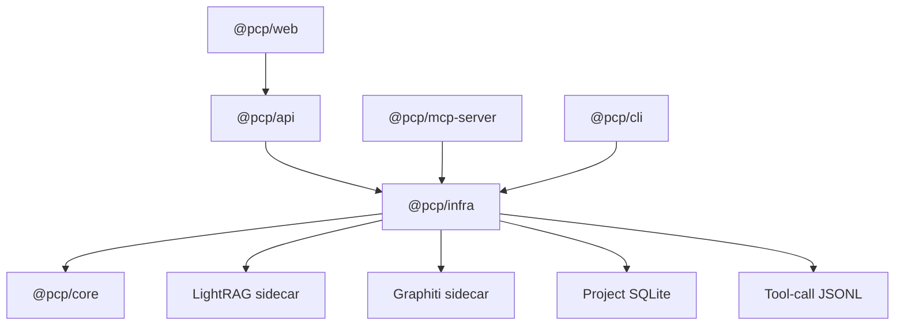
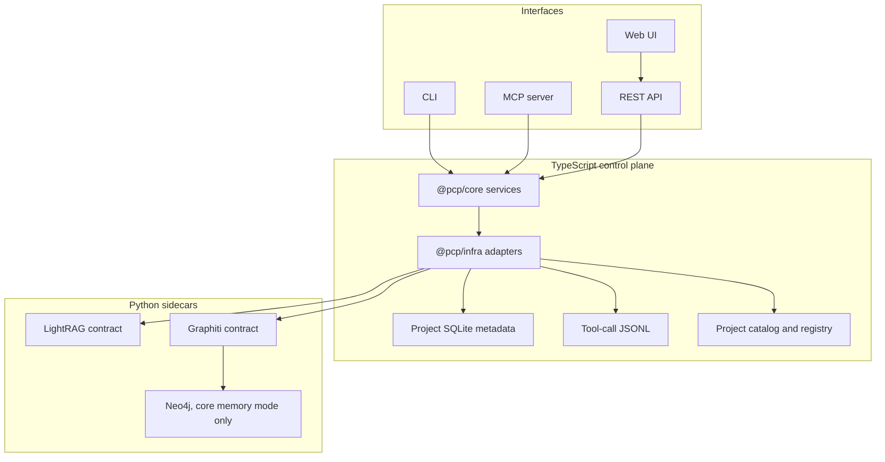

# Project Context Platform Technical Blueprint

Last researched: 2026-05-17

This blueprint defines the intended technical shape of Project Context Platform
(PCP) as a local-first context control plane for AI-assisted development. It is
a synthesis of the current system map, repository README, handover guide, and
SPDD analysis artifacts.

This document is not an implementation changelog. Use it to make architecture
decisions, scope future work, and verify that new code fits the platform model.

## Source Basis

Primary sources:

- `docs/system/system-service-map.md`
- `README.md`
- `docs/system-handover.md`
- `spdd/analysis/GGQPA-XXX-202605122100-[Analysis]-project-context-platform-srs.md`
- `spdd/analysis/GGQPA-XXX-202605131230-[Plan]-full-lightrag-graphiti-embedding-pipeline.md`
- `spdd/analysis/GGQPA-XXX-202605140906-[Analysis]-lightrag-core-index-optimization.md`
- `spdd/analysis/GGQPA-XXX-202605140946-[Analysis]-spdd-trace-registry.md`
- `spdd/analysis/GGQPA-XXX-202605141607-[Analysis]-context-freshness-quality-graph.md`
- `spdd/analysis/GGQPA-XXX-202605141713-[Analysis]-context-graph-query-parameters.md`
- `spdd/analysis/GGQPA-XXX-202605151516-[Analysis]-granular-markdown-indexing.md`
- `spdd/analysis/GGQPA-XXX-202605151948-[Analysis]-server-aware-table-pagination.md`
- `spdd/analysis/GGQPA-XXX-202605152109-[Analysis]-prepare-feature-context-staged-retrieval.md`
- `packages/core/src/**`
- `packages/infra/src/**`
- `packages/api/src/**`
- `packages/mcp-server/src/**`
- `packages/cli/src/**`
- `packages/web/src/**`

## Architecture Thesis

PCP is a TypeScript control plane with Python sidecars. The TypeScript layer owns
project identity, file discovery, stable ID extraction, ingestion orchestration,
retrieval composition, temporal-memory policy, SPDD traceability, REST/MCP/CLI
surfaces, and UI semantics. Python sidecars own vendor-specific retrieval and
memory engines behind PCP HTTP contracts.

The system has three durable context stores:

- Project SQLite metadata for exact local facts: ingestion jobs, chunks, stable
  IDs, SPDD artifacts, SPDD runs, and trace links.
- LightRAG sidecar state for canonical document/code retrieval.
- Graphiti sidecar state for temporal project memory and narrative facts.

The stores are intentionally not interchangeable. SQLite is the exact
traceability and UI index source. LightRAG is the retrieval engine. Graphiti is
the memory engine. Core services compose them.

## Package Architecture

PCP is a TypeScript ESM monorepo with small package boundaries and one runtime
composition root.

Dependency direction:

- `@pcp/core` has no dependency on `@pcp/infra`, REST, MCP, CLI, web, or
  sidecar implementation packages.
- `@pcp/infra` depends on `@pcp/core` and implements core ports.
- `@pcp/api`, `@pcp/mcp-server`, and `@pcp/cli` depend on `@pcp/infra` for
  `createAppServices()`.
- `@pcp/web` depends on REST over HTTP, not on `@pcp/core` or `@pcp/infra`.
- Python sidecars are external processes behind HTTP contracts, not TypeScript
  package dependencies.

The main TypeScript composition root is `packages/infra/src/app-services.ts`.
It builds the object graph once per process:

- `GlobalRegistryStore`
- `ProjectWorkspaceService`
- `ProjectMetadataRepository`
- local or HTTP LightRAG adapter based on `PCP_ADAPTER_MODE`
- local or HTTP Graphiti adapter based on `PCP_ADAPTER_MODE`
- `ProjectToolCallLogger`
- core services for ingestion, retrieval, memory, composition, validation,
  observability, deletion, and SPDD trace

This keeps application entrypoints thin. API, MCP, and CLI should not manually
construct lower-level services or choose adapter implementations outside this
composition root.

## Runtime View

Default local endpoints:

| Component | Endpoint | Responsibility |
| --- | --- | --- |
| REST API | `127.0.0.1:4318` | HTTP surface for UI and direct clients. |
| Web UI | `127.0.0.1:5173` | Operator interface. |
| LightRAG sidecar | `127.0.0.1:9621` | Retrieval HTTP contract. |
| Graphiti sidecar | `127.0.0.1:8091` | Memory HTTP contract. |
| Neo4j | `127.0.0.1:7474` / `127.0.0.1:7687` | Graphiti core backend only. |

## Package Ownership

| Package or service | Owns | Must not own |
| --- | --- | --- |
| `packages/core` | Domain types, config loading, workspace registration, ingestion, chunking, stable ID extraction, retrieval composition, memory policy, SPDD trace, observability. | HTTP route details, SQLite SQL, React state, vendor-specific Python behavior. |
| `packages/infra` | SQLite repositories, local adapters, HTTP adapters, JSONL logs, project-aware repository routing. | Business rules that need to be shared by REST, MCP, CLI, and UI. |
| `packages/api` | Fastify server, route validation, error mapping, health aggregation. | Retrieval semantics or sidecar-specific logic. |
| `packages/mcp-server` | Tool registration, schema mapping, output previewing, tool-call logging. | Behavior that diverges from REST for the same capability. |
| `packages/cli` | Developer commands over the same core services. | Persistent application state independent from project config/catalog. |
| `packages/web` | Project operator UI over REST APIs. | Adapter mode checks or direct sidecar calls. |
| `services/lightrag` | PCP retrieval sidecar contract, LightRAG core integration, retrieval manifests, project retrieval cleanup. | Workspace scanning, stable ID extraction, Graphiti memory, UI behavior. |
| `services/graphiti` | PCP memory sidecar contract, Graphiti core integration, memory audit ledger, project memory cleanup. | Document indexing, source scanning, SPDD artifact discovery. |

## Design Patterns

### Hexagonal Core

The project uses a ports-and-adapters pattern.

- Core ports live in `packages/core/src/ports/adapters.ts`.
- Core services depend on `LightRagAdapter`, `GraphitiAdapter`,
  `MetadataRepository`, and `ToolCallLogger` interfaces.
- Infrastructure implements those ports with SQLite, JSONL, local fallback
  adapters, and HTTP sidecar adapters.
- Transport packages call core services through the composed service graph; they
  do not own business behavior.

This pattern is mandatory for capabilities that must work through REST, MCP,
CLI, and local tests.

### Service Layer

Domain behavior is organized as constructor-injected service classes:

- `ProjectWorkspaceService` owns project registration, catalog/registry lookup,
  active project resolution, and workspace config creation.
- `IngestionService` owns scan/filter/read/chunk/extract/merge/ingest job
  orchestration.
- `RetrievalService` is a thin project-resolution facade over the LightRAG port.
- `ContextComposerService` owns feature/review/validation composition and staged
  retrieval orchestration. `validateAgainstSpecs` performs deterministic,
  evidence-first checks (exact requirement resolution via `StagedRetrievalPipeline`,
  `MetadataRepository` chunks plus SPDD artifact/trace linkage for declared paths,
  freshness via `ContextObservabilityService`, bounded plan/diff token scans,
  and advisory temporal-memory overlap) without writes or LLM calls; MCP
  `validate_against_specs` and REST `POST .../validate` stay additive on inputs.
- `TemporalMemoryService` owns memory write risk rules and routes memory events
  to Graphiti methods.
- `SpddTraceService` owns artifact sync, work-run recording, trace-link creation,
  reverse lookup, and optional memory mirroring.
- `ContextObservabilityService` owns freshness, quality metrics, and derived
  context graph construction.
- `ProjectDeletionService` owns destructive project cleanup across metadata,
  sidecars, generated project state, catalog, and registry.

Services should stay cohesive and should not take dependencies on Fastify,
Commander, React, MCP SDK request objects, or sidecar-specific response shapes.

### Repository And Project Routing

`ProjectMetadataRepository` is a project-aware repository proxy. It resolves the
workspace for each `project_id`, opens or reuses a `SqliteMetadataRepository`
for that project's `.project-context/metadata.sqlite`, then delegates the
operation.

`SqliteMetadataRepository` stores JSON payloads in normalized project-scoped
tables with useful indexes. This preserves typed DTO evolution while still
allowing exact SQL filters for SPDD trace targets, run IDs, artifact paths,
chunk status, and registry rows.

Repository rules:

- Every query and write must include `project_id`.
- Repository implementations should not resolve active projects; callers must
  pass an explicit project ID after service-level resolution.
- Bulk writes should use transactions when updating multiple rows.
- Stale records are updated in place as historical facts rather than silently
  removed during normal ingest.

### Adapter Families

There are two adapter families for retrieval and memory:

- HTTP adapters call Python sidecars with `JsonHttpClient` and project-scoped
  `x-project-id` headers.
- Local adapters satisfy the same core ports without sidecars for tests,
  development, and offline smoke paths.

Adapter selection is centralized in `createAppServices()`. UI, REST handlers,
MCP tools, CLI commands, and core services must not branch on local vs HTTP
mode.

### Strategy Pattern For Chunking

Ingestion chunking is implemented as a strategy selector:

- `ChunkingStrategySelector` chooses an `IngestionChunkingStrategy`.
- `MarkdownChunkingStrategy` handles Markdown/MDX section chunks, stable-ID
  anchors, and table-row chunks.
- `FileLevelChunkingStrategy` handles non-Markdown files as one file chunk.
- Chunk IDs are deterministic from project, path, kind, line range, heading, and
  stable IDs.

New source-aware chunking should add a strategy, not conditional parsing inside
`IngestionService`, adapters, or retrieval code.

### Staged Pipeline Pattern

`ContextComposerService` delegates retrieval staging to
`StagedRetrievalPipeline`. The pattern is:

1. Resolve exact requirement/spec sources.
2. Run cheap manifest candidate discovery.
3. Retrieve Graphiti facts independently.
4. Optionally run budgeted semantic retrieval.
5. Merge exact and supplemental layers.
6. Assemble the stable `FeatureContextResponseDTO` shape with warnings.

This is the preferred model for agent-facing composition: exact context first,
semantic calls scoped and opt-in, and each source isolated as its own failure
domain.

`validateAgainstSpecs` follows the same spirit for verification flows: resolve explicit requirement IDs before trusting fuzzy matches; incorporate SQLite-derived freshness and trace evidence before treating textual overlap as meaningful.

### Transport Boundary Pattern

REST routes use Zod parsing and `PlatformError` mapping. MCP tools use a wrapper
that records compact tool-call logs and returns `{ ok, result }` or
`{ ok, error }`. CLI commands call the same services and print JSON. The web UI
calls REST with `fetchJson`.

Transport packages may parse and normalize inputs, but business rules belong in
core services or core-adjacent shared parser functions.

### Error Pattern

`PlatformError` is the cross-layer structured error type. It carries code, HTTP
status, details, optional project ID, and retryability. Fastify error handlers,
HTTP adapters, MCP wrappers, and CLI top-level handlers all map unknown errors
into this shape.

New errors should use explicit platform codes when callers need stable handling.
Sidecar upstream errors should preserve project scope and retryability.

### UI Pattern

The web package is a REST-backed React operator console:

- `main.tsx` owns app-level project selection and data loading.
- Tab components own focused surfaces where complexity justifies separation.
- `Panel` and `Table` provide shared list rendering.
- `Table` supports default client-side filtering/sorting/pagination and optional
  server-side pagination for large REST-backed datasets such as Document Index.
- Formatters centralize display of cells, headers, dates, statuses, long cells,
  and artifact rows.

The UI should not duplicate core semantics. If an agent needs the same behavior,
put it behind REST/MCP through core services first.

## Data Ownership

| Data | Source of truth | Notes |
| --- | --- | --- |
| Registered workspaces | Project catalog and global registry | Used by API, CLI, and MCP project resolution. |
| Project configuration | `<project>/.project-context/config.yml` | Include/ignore rules, ID rules, sidecar URLs, memory policy, API/UI defaults. |
| Ingestion jobs | Project SQLite metadata | Audit of full, changed, and document ingestion. |
| Canonical chunks | Project SQLite plus LightRAG state | SQLite supports exact local metadata and UI listing; LightRAG supports retrieval. |
| Stable IDs and aliases | Project SQLite metadata | Durable anchors for specs, decisions, tasks, ACs, and traceability. |
| SPDD artifacts/runs/links | Project SQLite metadata | Exact prompt-driven work provenance. |
| Tool-call summaries | Project JSONL logs | Compact audit evidence, not complete payload replay. |
| Memory events | Graphiti sidecar audit/core store | Decisions, requirement changes, reviews, implementation summaries, approvals, facts, and history. |

## Context Model

PCP separates context into exact, semantic, temporal, and operational layers.

| Layer | Primary API/tool family | Backing data | Intended use |
| --- | --- | --- | --- |
| Exact specs | `get_spec_context`, `get_requirement_sources`, `get_document` | Current chunks and stable ID registry | Stable-ID or source-path anchored lookup. |
| Semantic discovery | `search_docs`, `get_related_code` | LightRAG sidecar | Candidate discovery after exact anchors are unknown or insufficient. |
| Composed feature context | `prepare_feature_context` | Exact specs, manifest discovery, LightRAG, Graphiti | Agent-ready implementation context. |
| Temporal memory | `get_current_facts`, `get_history`, memory writes | Graphiti sidecar | Durable decisions, changes, reviews, summaries, approvals. |
| SPDD trace | `sync_spdd_artifacts`, `record_spdd_run`, `list_spdd_trace`, `lookup_spdd_trace` | Project SQLite metadata | Prompt/run to ID/path/chunk/feature provenance. |
| Context observability | freshness, quality metrics, context graph | Metadata, trace links, tool logs | Trust and topology checks before/after work. |

Broad retrieval is never authoritative by itself. When a stable ID, source path,
chunk ID, run ID, or artifact path is known, exact metadata-backed tools should
run first.

## Critical Workflows

### Project Registration

1. CLI/API resolves a local root.
2. Workspace service creates or loads `.project-context/config.yml`.
3. Project metadata is added to the catalog and global registry.
4. The project becomes addressable by REST, MCP, CLI, and UI.

Registration does not index files and does not call sidecars.

### Ingestion

1. Caller requests full, changed, or document ingestion.
2. Core resolves the project and config.
3. Core scans only indexable paths and applies hard safety ignores.
4. Core reads files and extracts stable IDs.
5. Chunking strategy emits canonical document chunks.
6. ID registry entries are merged into SQLite.
7. LightRAG adapter ingests prepared chunk payloads.
8. Old chunks for replaced paths are marked stale.
9. Ingestion job is saved in SQLite.

Markdown/MDX uses granular chunking by heading, stable-ID anchor, and table row.
Non-Markdown files remain file-level until a separate code-aware strategy is
approved.

### Exact Retrieval

1. Caller supplies a stable ID, alias, source path, or chunk ID.
2. Retrieval service queries current exact records.
3. Stable-ID matches return the smallest useful anchored chunk.
4. Neighbor context is opt-in and source-local.
5. Duplicate or ambiguous IDs must be visible, not silently collapsed.

### Feature Context Preparation

`prepare_feature_context` should behave as a staged composer, not a broad RAG
wrapper.

1. Resolve explicit requirement/task IDs first.
2. Run exact spec and requirement-source lookups.
3. Run cheap manifest/keyword candidate discovery.
4. Retrieve Graphiti current facts independently.
5. In `fast` mode, stop after exact/manifest/memory sources.
6. In `semantic` mode, add one scoped semantic document call.
7. In `deep` mode, add scoped document and code/test semantic calls in parallel.
8. Return partial context with warnings when any source fails.

Semantic retrieval must be budgeted and scoped with filters such as document
types, source-path prefixes, chunk kinds, query mode, top-k limits, token
budgets, and per-request timeout.

### Temporal Memory

1. Core validates memory type, risk, approval rules, and project scope.
2. Graphiti adapter sends the event through the sidecar contract.
3. Contract mode writes JSON audit events.
4. Core mode writes JSON audit events and Graphiti episodes.
5. Reads return current facts or temporal history scoped to one project.

Indexed project documents are not automatically memory events. Agents and tools
must explicitly record decisions, requirement changes, reviews, implementation
summaries, and approvals.

### SPDD Trace

1. Artifact sync scans SPDD prompt, analysis, plan, and review directories.
2. SQLite stores artifact path, type, title, hash, stable IDs, and status.
3. Work runs are recorded explicitly after prompt-driven work.
4. Runs link to stable IDs, source paths, chunks, feature refs, tool calls, and
   optional memory events.
5. Short summaries may be mirrored to Graphiti as implementation memory.
6. UI and MCP support forward and reverse lookup.

SPDD prompt files do not need to be LightRAG-indexed to be trace-cataloged.
Stable IDs and source paths are durable trace anchors. Chunk IDs are precise but
revision-sensitive.

### Context Observability

Freshness, quality metrics, and context graph are derived read models. They must
not introduce a new graph database until derived metadata views prove
insufficient.

Freshness distinguishes factual signals from heuristics:

- Factual: stale chunks, stale registry rows, missing SPDD artifacts,
  unresolved trace links, failed ingestion jobs.
- Heuristic: changed files not indexed, suspected unrecorded SPDD runs, low
  validation usage.

The context graph has two query modes:

- Snapshot mode for bounded project overviews.
- Anchored mode for neighborhoods around a run, artifact, source path, stable
  ID, or feature reference.

Anchored graph queries should support depth, edge type, status, relation, direct
filters, deterministic ordering, and hard output limits.

## Sidecar Contracts

### LightRAG

The LightRAG sidecar exposes the PCP retrieval contract:

- Health diagnostics.
- Prepared chunk ingestion.
- Indexed document listing.
- Search.
- Exact spec context.
- Related code/test candidate retrieval.
- Requirement source retrieval.
- Document lookup.
- Project retrieval-state deletion.

Contract mode must remain deterministic and cheap for local tests. Core mode is
explicit, configured by backend mode, and may use LLM/embedding providers.
Credentials alone must not activate core behavior.

Core-mode responsibilities:

- Isolated per-project working directories.
- Manifest mapping from LightRAG document records to PCP paths, stable IDs,
  headings, chunk metadata, and content hashes.
- Full-ingest reconciliation for removed files.
- Changed/document ingest replacement for affected paths.
- Batch insert where safe.
- Lifecycle finalization on shutdown/engine eviction.
- Conservative concurrency and query-budget settings.
- Additive health diagnostics for query mode, embedding model/dimension, and
  tuning.

### Graphiti

The Graphiti sidecar exposes the PCP memory contract:

- Health diagnostics.
- Memory writes for decisions, requirement changes, reviews, implementation
  summaries, and approvals.
- Current facts.
- Temporal history.
- Project memory deletion.

Contract mode stores JSON audit events. Core mode uses Graphiti and Neo4j while
preserving a JSON audit ledger for exact replay and migration safety.

Core-mode responsibilities:

- Project namespace isolation.
- Provider and concurrency configuration.
- Memory writes as Graphiti episodes.
- Querying facts/history through Graphiti where available.
- Safe project-scoped cleanup.
- Diagnostics for graph readiness and provider readiness.

## UI Blueprint

The web UI is an operator console over REST APIs. It should expose facts already
owned by core services and sidecars; it must not compute platform semantics that
agents cannot access through REST/MCP.

Current tab model:

- Projects
- Ingestion
- Document Index
- ID Registry
- Search
- Memory
- Approvals
- Tool Call Logs
- Context Health
- SPDD Trace
- Settings

Table behavior:

- Generic tabs use client-side filtering, sorting, and pagination.
- Document Index uses server-side pagination because it represents potentially
  large indexed chunk sets.
- Server pagination owns API `limit` and `offset`; changing row count resets the
  page to the first offset.
- Local filtering in a server-paginated table applies only to the loaded page
  unless a future server-side filter contract is added.

## API And MCP Parity

REST and MCP are two transports over the same core behavior. New capabilities
should be added in this order:

1. Domain types and core service behavior.
2. Adapter contract changes, if needed.
3. REST route validation and error mapping.
4. MCP tool schema and preview shaping.
5. CLI command, when developer workflow benefits.
6. Web UI surface, when operator visibility benefits.
7. Contract documentation and handover updates.

MCP tools should preview large discovery outputs and require exact tools for
full content. MCP must not implement alternate behavior that REST cannot call.

## Reliability Rules

- Prefer metadata-backed exact retrieval before semantic retrieval.
- Return partial context with warnings when broad retrieval or memory sources
  fail.
- Keep expensive semantic calls opt-in, scoped, and budgeted.
- Do not retry long semantic POST timeouts by default.
- Preserve project isolation in every query, sidecar request, trace link, memory
  event, and deletion path.
- Treat stale/missing/unresolved records as historical context, not automatic
  deletion candidates.
- Keep health checks cheap and non-secret.
- Keep contract mode useful for CI, offline smoke tests, and deterministic
  debugging.

## Security And Local-State Rules

PCP is local-first by default. The API should bind to localhost unless remote
binding is explicitly enabled. There is no complete remote authentication model
in the standard local development path.

Generated project state belongs under `.project-context/` and should stay out of
git. Sidecar Docker volumes hold generated retrieval/memory state. Source files
outside `.project-context/` are not deleted during normal project
unregistration unless an explicit project-context cleanup option is used.

Prompt and memory contents can contain sensitive information. SPDD trace APIs
should store and expose compact metadata, hashes, paths, IDs, statuses, and
summaries rather than full prompt bodies by default.

## Extension Blueprint

Use these rules when adding capabilities:

1. Start in `packages/core` when behavior is shared by REST, MCP, CLI, or UI.
2. Keep adapter mode invisible to callers.
3. Keep sidecars generic and contract-oriented.
4. Add chunking by strategy, not scattered extension branches.
5. Add graph-like views as derived metadata reads before adding new storage.
6. Add stable ID/source-path anchors before chunk-only trace links.
7. Preserve existing defaults and make expensive behavior opt-in.
8. Add tests at the lowest behavior-owning layer first.
9. Update contract docs when request/response shapes change.
10. After meaningful implementation, ingest changed files and record SPDD trace
    or memory summary as appropriate.

## Prioritized Evolution

High priority:

- Make fast feature-context preparation strictly metadata-backed and
  partial-response-safe.
- Improve code/test retrieval with a dedicated structural chunking strategy.
- Add canonical-source ranking for duplicate stable ID lookups.
- Separate new ingestion warnings from known duplicate warnings.

Medium priority:

- Expand anchored context graph queries with root, depth, edge type, status,
  relation, direct filters, and deterministic ordering.
- Add diagnostics to empty memory responses.
- Add a dedicated MCP document-index listing tool that mirrors the REST
  document listing endpoint.
- Add source-path and chunk-kind filters to related-code discovery where not yet
  exposed.

Lower priority:

- Add richer UI affordances for copying exact source paths, stable IDs, and
  chunk IDs from Document Index and Context Graph.
- Backfill missing canonical documentation navigation files if they remain part
  of the intended docs structure.
- Add retrieval-quality benchmark queries and top-k precision reporting.

## Non-Goals

- Do not replace Git as the source of truth for repository content.
- Do not make LightRAG the source of truth for workflow provenance.
- Do not make Graphiti the source of truth for exact prompt-to-chunk relations.
- Do not require external vector databases for the standard local runtime.
- Do not make SPDD trace mandatory for all work; it is additive traceability.
- Do not infer implementation correctness from freshness, quality metrics, or
  graph connectivity.

## Architectural Checks For New Work

Before merging a change, verify:

- The owning layer is correct.
- Project isolation is explicit.
- Exact tools remain available when identifiers are known.
- Broad retrieval is scoped, budgeted, and failure-isolated.
- Stale/deleted records have defined behavior.
- REST and MCP semantics remain aligned.
- UI behavior does not bypass core services.
- Tests cover the domain behavior, adapter contract, and transport surface
  affected by the change.
- Documentation describes any new operator or agent workflow.
